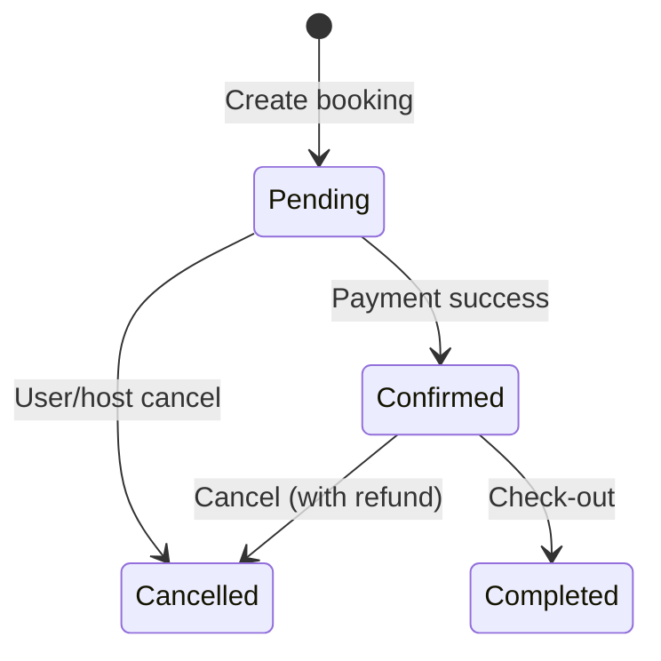

# Backend Feature Specifications

## Feature 1: User Authentication
*Secure account access with OAuth/email-password options*

### Functional Requirements
1. **Registration**:
   - Email/password signup with verification
   - OAuth integration (Google/Facebook)
   - Profile initialization (role: guest/host)
2. **Login**:
   - JWT token generation (access + refresh)
   - Rate limiting (5 attempts/min)
   - Session management
3. **Security**:
   - Password hashing (bcrypt)
   - OAuth token validation
   - Refresh token rotation

### Technical Specifications
**API Endpoints**:
| Method | Path               | Description                |
|--------|--------------------|----------------------------|
| POST   | `/auth/register`   | Email/password registration |
| POST   | `/auth/oauth`      | OAuth registration/login   |
| POST   | `/auth/login`      | Email/password login       |
| POST   | `/auth/refresh`    | Refresh access token       |
| POST   | `/auth/verify`     | Email verification         |

**Input/Output**:
```json
// REGISTER INPUT
{
  "email": "user@domain.com",
  "password": "SecurePass123!",
  "role": "host" // or "guest"
}

// SUCCESS OUTPUT
{
  "access_token": "eyJhbGciOiJIUzI1NiIsInR5cCI6IkpXVCJ9...",
  "expires_in": 3600,
  "refresh_token": "eyJhbGciOiJIUzI1NiIsInR5cCI6IkpXVCJ9..."
}
```

### Validation Rules
| Field       | Rules                                      |
|-------------|--------------------------------------------|
| Email       | Valid format + MX record check             |
| Password    | 8+ chars, 1 uppercase, 1 number, 1 symbol |
| Role        | Must be "guest" or "host"                  |
| OAuth       | Validate ID token signature + issuer       |

### Performance Criteria
| Metric                  | Target      |
|-------------------------|-------------|
| Response time (p99)     | < 500ms     |
| System uptime           | 99.95%      |
| Concurrent users        | 10,000      |
| Token generation        | < 100ms     |

---

## Feature 2: Property Management
*Host-facing property listing operations*

### Functional Requirements
1. **Create Listing**:
   - Multi-step form (details, photos, pricing)
   - Automatic geocoding from address
   - Calendar availability initialization
2. **Update/Delete**:
   - Atomic updates with version control
   - Cascade delete bookings (future dates)
   - Audit trail for changes
3. **Search Indexing**:
   - Real-time Elasticsearch sync
   - Amenity-based tagging (wifi, pool etc.)

### Technical Specifications
**API Endpoints**:
| Method | Path                     | Description                |
|--------|--------------------------|----------------------------|
| POST   | `/host/listings`         | Create new listing         |
| PUT    | `/host/listings/{id}`    | Update listing            |
| DELETE | `/host/listings/{id}`    | Delete listing            |
| GET    | `/host/listings`         | List host's properties    |
| GET    | `/listings/{id}`         | Get listing details       |

**Input/Output**:
```json
// CREATE LISTING INPUT
{
  "title": "Beachfront Villa",
  "address": "123 Coast Rd, Malibu, CA",
  "price_per_night": 175.00,
  "amenities": ["wifi", "pool"],
  "availability": {
    "min_stay": 2,
    "max_guests": 6
  }
}

// SUCCESS OUTPUT
{
  "id": "prop_abc123xyz",
  "geo_location": { "lat": 34.0259, "lng": -118.7798 },
  "index_status": "processing"
}
```

### Validation Rules
| Field          | Rules                              |
|----------------|------------------------------------|
| Title          | 5-100 characters                   |
| Address        | Full address components required   |
| Price          | $10-$10,000/night                 |
| Photos         | 1-24 images (5MB max each)         |
| Amenities      | From predefined taxonomy           |
| Availability   | min_stay ≥ 1, max_guests ≥ 1       |

### Performance Criteria
| Metric                | Target          |
|-----------------------|-----------------|
| Creation latency      | < 1s            |
| Search index delay    | < 30s           |
| Bulk operations       | 100+ listings/s |
| Geolocation accuracy  | 95%+            |

---

## Feature 3: Booking System
*End-to-end reservation workflow*

### Functional Requirements
1. **Availability Check**:
   - Real-time calendar conflicts
   - Pricing rules (seasonal/weekend rates)
2. **Payment Integration**:
   - Hold authorization at booking
   - Capture on check-in
   - Automated host payouts
3. **State Management**:



### Technical Specifications

**API Endpoints**:
| Method | Path                     | Description                |
|--------|--------------------------|----------------------------|
| POST   | `/bookings`              | Create new booking         |
| POST   | `/bookings/{id}/cancel`  | Cancel existing booking    |
| GET    | `/bookings/{id}`         | Get booking status/details |
| GET    | `/properties/{id}/availability` | Check property availability |

**Input/Output**:
```json
// BOOKING INPUT
{
  "property_id": "prop_abc123",
  "dates": ["2025-07-15", "2025-07-20"],
  "payment_token": "tok_visa_123",
  "guests": 4
}

// SUCCESS OUTPUT
{
  "booking_id": "bkg_zxy987",
  "total_charged": 875.00,
  "confirmation_code": "H7J9K2",
  "next_steps": ["confirm_email", "add_payment_method"]
}
```

### Validation Rules
| Field          | Rules                              |
|----------------|------------------------------------|
| Dates          | Future dates only, min/max stay enforced |
| Guests         | ≤ property max capacity            |
| Payment Token  | Valid Stripe/PayPal token format   |
| Property ID    | Active, non-deleted listing        |

### Performance Criteria
| Metric                | Target      |
|-----------------------|-------------|
| Availability check    | < 200ms     |
| Payment processing    | < 1.5s      |
| Cancellation refunds  | < 5min      |
| Booking creation TPS  | 500+        |

---

## Cross-Functional Requirements

### Security
- PCI-DSS compliance for payment processing  
- GDPR data anonymization for deleted accounts  
- RBAC (Role-Based Access Control) for guests/hosts/admins  
- Encryption: AES-256 at rest, TLS 1.3 in transit  

### Observability
| Type       | Implementation                         |
|------------|----------------------------------------|
| Logging    | Structured JSON logs with request IDs  |
| Metrics    | Prometheus: API latency/error rates    |
| Tracing    | Jaeger: End-to-end workflow tracking   |

### Resilience
- Idempotency keys for POST operations  
- Circuit breakers for payment gateway failures  
- Automatic calendar conflict resolution  
- Dead-letter queues for failed payment processing  

---

## Compliance Requirements
| Regulation | Implementation Details               |
|------------|--------------------------------------|
| PSD2       | SCA via 3D Secure for payments       |
| SOC 2      | 7-year audit log retention           |
| CCPA       | Right-to-delete API endpoint         |
| GDPR       | Data processing agreements with vendors |

### Implementation Standards
- **Currency**: USD (ISO 4217)  
- **Dates**: ISO 8601 (YYYY-MM-DD)  
- **Errors**: RFC 7807 (Problem Details)  
```json
{
  "type": "https://errors/booking/conflict",
  "title": "Date unavailable",
  "detail": "2025-07-18 already booked",
  "instance": "/bookings"
}
```
